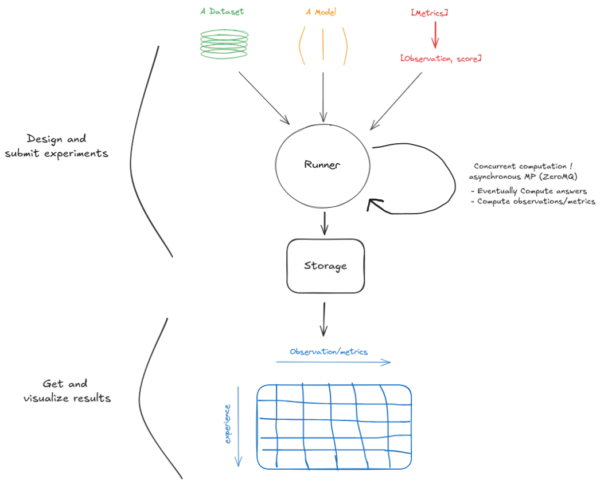

# EvalAP

<p align="center">
  
</p>

## Overview

EvalAP "Evaluation API and Platform" is a high-level service designed to perform evaluations for Etalab.
This project provides an API to evaluate [LLM] models and an interface to navigate datasets, models, metrics and experiments.



## Quickstart

Running evalap for the impatient:

```
docker compose -f compose.dev.yml up -d postgres
# sudo apt install just
just run
```

You can then access the EvalAP UI at: http://localhost:8501
and find the EvalAP API at http://localhost:8000/docs


## Ressources

For guidance on how to use this project, please refer to the following resources:

- The documentation: https://evalap.etalab.gouv.fr/doc
- The public instance interface: https://evalap.etalab.gouv.fr/
- the demo notebooks: [notebooks/](notebooks/)

## Contributing

You can open issues for bugs you've found or features you think are missing. You can also submit pull requests to this repository.
To get started, take a look at [CONTRIBUTING.md](CONTRIBUTING.md).


## License

MIT License
