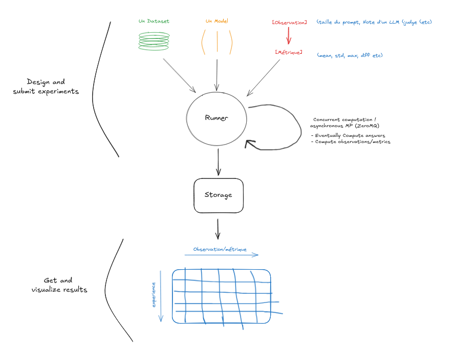

# Evaluation General One (EG1)

## Overview

Albert General One is a high-level application based on FastAPI designed to perform evaluations for Etalab. This project provides an API for accessing evaluation data, calculating metrics, [and interacting with a Streamlit-based interface -- not available]. The main objective is to compute, manage and analyze evaluation data.

## Ressources

For guidance on how to use this project, please refer to the following resources:

- The api reference: https://eg1.etalab.gouv.fr
- the demo notebooks: [notebooks/](notebooks/)

## Contributing

You can open issues for bugs you've found or features you think are missing. You can also submit pull requests to this repository. 
To get started, take a look at [CONTRIBUTING.md](CONTRIBUTING.md).

## License

To be defined.
